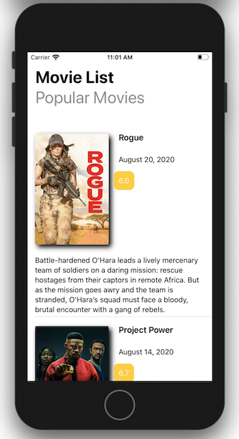

# Movie List
 
Make movie list using MVVM architecture design pattern <br>

Based on curiosity to gain insight into design patterns in app development, especially iOS also I want to Improve my object-oriented skills & learning to improve code quality. I think there is so many architectures out there. All of those architectures have, the pros and the cons, but they are all designed to make the code simpler and clearer. In this challenge I want learnt using MVVM architecture
Model-View-ViewModel (MVVM). MVVM is an architecture that focuses on the separation of development of user interface from development of the business logic.


>MVVM diagram made by yours truly

## What i  learn

* Using SwiftUI
* Implement mvvm architecture 
* Using [Themoviedb.org]("https://api.themoviedb.org/) API to get popular movies
* Using ObservableObject protocol
* Display data to the user based on the view model

## How to get the API key 
* Go to the [https://www.themoviedb.org]("https://www.themoviedb.org") page, then click Register.
* After API Key has been created successfully, and now let's try to test the get film data request using the API Key that you created earlier.
* Paste the key in Api.swift file in Utils folder
```
struct API {
    static let key = "YOUR_KEY_HERE"
}
```

## Screenshot



## Further Reading

[Data Binding in MVVM on iOS]("https://medium.com/flawless-app-stories/data-binding-in-mvvm-on-ios-714eb15e3913") <br>
[Observable object]("https://www.hackingwithswift.com/quick-◊start/swiftui/observable-objects-environment-objects-and-published") <br>
[MVVM playlist tutorial]("https://www.youtube.com/playlist?list=PLbrKvTeCrFAf3BBqfGR9B9C5XXAVa6D4r")<br>
[URL Image SwiftUI View]("https://medium.com/@bradysmurphy/day-14-image-loader-bf0a383f09da")